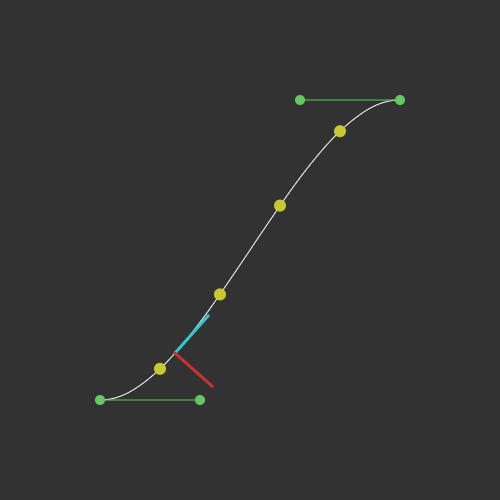
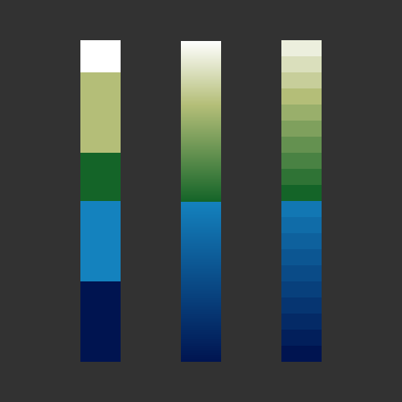
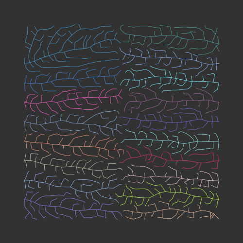
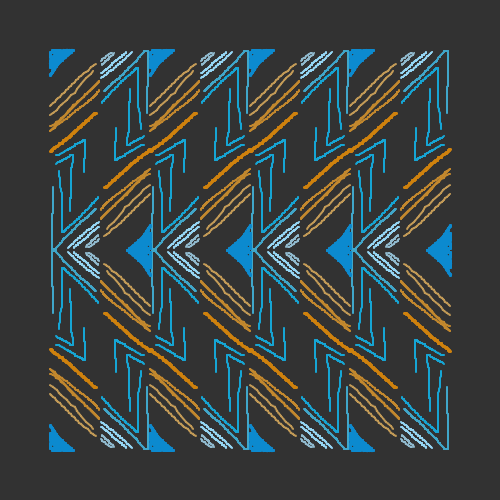
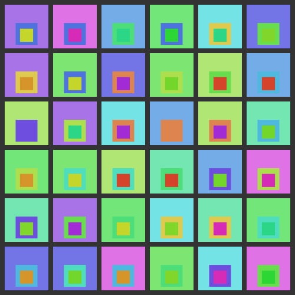
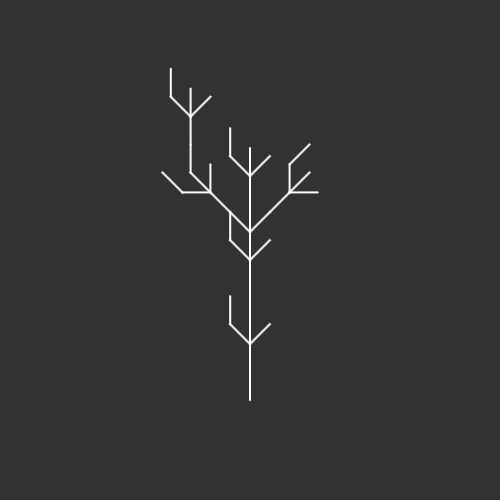
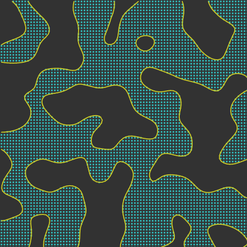
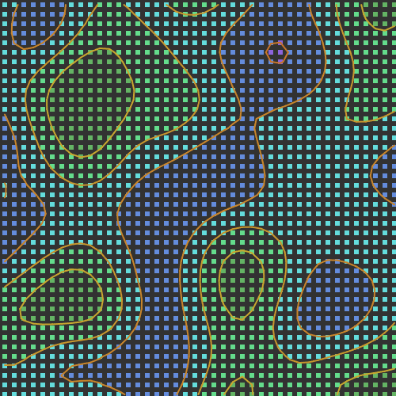
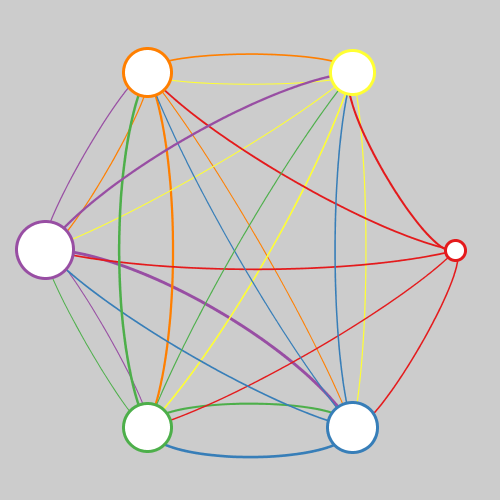

sketchbook
==========

Collection of personal coding projects. They may or may not grow into individual projects.

## Latest

A [p5js][p5js] sketch to draw a soccer field, built up through a series of iterations and also available on p5js.editor.org interface.

[][link-p5js-soccer-field]

## LÖVE
Collection of sketches using the [LÖVE][love2d] environment.

[][link-love2d-game-of-life]

## paper.js
Collection of sketches using the [paper.js][paperjs] Javascript library.

[][link-paperjs-10-print]
[][link-paperjs-drawing-app]
[][link-paperjs-interaction-of-color]
[][link-paperjs-race-track]

## p5.js Common Examples
Collection of sketches using the [p5.js][p5js] Javascript library which demonstrate utility classes that this repo has in [p5js/common](https://github.com/brianhonohan/sketchbook/tree/main/p5js/common) to augment the built-in capability of p5.js library.

[][link-p5js-bezier]
[][link-p5js-bezier-2]
[][link-p5js-bouncing]
[][link-p5js-color-ramp]
[][link-p5js-draggable]
[][link-p5js-geometry-circle-line]
[][link-p5js-geometry-line-to-line]
[][link-p5js-geometry-point-to-line]
[][link-p5js-layout-options]
[][link-p5js-paisley]
[][link-p5js-paisley-2]
[][link-p5js-quadtree]
[][link-p5js-quadtree-2]
[][link-p5js-quadtree-3]
[][link-p5js-rotation-between-vectors]
[][link-p5js-shapes-tangents-between-circles]
[][link-p5js-space-colonization]
[][link-p5js-teardrops]
[][link-p5js-terrain]
[][link-p5js-utils-random-color]
[][link-p5js-voronoi]
[][link-p5js-voronoi-2]
[][link-p5js-voronoi-3]
[][link-p5js-voronoi-4]

## p5.js Scales
Collection of sketches using the [p5.js][p5js] Javascript library, which are my way of learning about how built-in p5.js functions work, by practicing my 'scales' (like learning to play the piano).

[][link-p5js-scales-blendmode]
[][link-p5js-scales-palettelerp]

## p5.js
Collection of sketches using the [p5.js][p5js] Javascript library.

[][link-p5js-ecosystem-2]
[][link-p5js-ecosystem]
[][link-p5js-forest-01]
[][link-p5js-forest-02]
[][link-p5js-forest-fires-02]
[][link-p5js-forest-fires]
[][link-p5js-friezes-2]
[][link-p5js-friezes]
[][link-p5js-grid-puzzle]
[][link-p5js-hello_world]
[][link-p5js-josef-albers-homage-to-a-square]
[][link-p5js-keyviz]
[][link-p5js-logic-gates]
[][link-p5js-meandering-river]
[][link-p5js-nautical-flags-02]
[][link-p5js-nautical-flags]
[][link-p5js-paisley-01]
[][link-p5js-slippy-map]
[][link-p5js-snowflake-pen]
[][link-p5js-soccer-field]
[][link-p5js-thermal-cells]
[][link-p5js-tree-rings]
[][link-p5js-voronoi-herd]

## p5.js - Random Sketches
Collection of sketches using the [p5.js][p5js] Javascript library, created without any specific intent, often iterating on earlier versions.

[][link-p5js-random-001]
[][link-p5js-random-002]
[][link-p5js-random-003]
[][link-p5js-random-004]
[][link-p5js-random-005]
[][link-p5js-random-006]
[][link-p5js-random-007]
[][link-p5js-random-008]
[][link-p5js-random-009]
[][link-p5js-random-010]
[][link-p5js-random-011]
[][link-p5js-random-012]
[][link-p5js-random-013]
[][link-p5js-random-014]
[][link-p5js-random-015]
[][link-p5js-random-016]
[][link-p5js-random-017]
[][link-p5js-random-018]
[][link-p5js-random-019]

## p5.js - Coding Challenges
Collection of sketches using the [p5.js][p5js] Javascript library inspired by the [Coding Train's][coding-train] [Coding Challenges][coding-train-cc].

[][link-p5js-cc-fractal-trees-01]
[][link-p5js-cc-fractal-trees-02]
[][link-p5js-cc-fractal-trees-03]
[][link-p5js-cc-fractal-trees-04]
[][link-p5js-cc-fractal-trees-05]
[][link-p5js-cc-lorenz-attractor]
[][link-p5js-cc-marching-squares]
[][link-p5js-cc-marching-squares-2]
[][link-p5js-cc-marching-squares-3]
[][link-p5js-cc-maze-generator]
[][link-p5js-cc-mitosis]
[][link-p5js-cc-seven-segment-display]
[][link-p5js-cc-snake]
[][link-p5js-cc-solar-system]
[][link-p5js-cc-solar-system-3d]
[][link-p5js-cc-solar-system-3d-texturized]
[][link-p5js-cc-space-invaders]
[][link-p5js-cc-terrain-3d-flyover]

## pixiJS
Collection of sketches using the [pixiJS][pixijs] Javascript library.

[][link-pixijs-sketch-template]
[][link-pixijs-periodic-element]
[][link-pixijs-periodic-table]

## Processing
Collection of sketches using the [Processing (P3)][processing] environment.

[][link-attractors]
[][link-dodgeball]
[][link-event_sequencer]
[][link-fieldeq]
[][link-game_of_life]
[][link-hexagonal]
[][link-hockey]
[][link-hockey_01]
[][link-interaction_of_color]
[][link-keyviz]
[][link-network]
[][link-number_visualizer]
[][link-random_001]
[][link-series_plots]
[][link-smart_traffic]
[][link-spirals]
[][link-thermal_cells]
[][link-three_d_blocks]

[love2d]: https://love2d.org/
[p5js]: https://p5js.org/
[paperjs]: http://paperjs.org/
[pixijs]: https://pixijs.com/
[processing]: https://processing.org/
[coding-train]: https://www.youtube.com/channel/UCvjgXvBlbQiydffZU7m1_aw
[coding-train-cc]: https://www.youtube.com/watch?v=17WoOqgXsRM&list=PLRqwX-V7Uu6ZiZxtDDRCi6uhfTH4FilpH&index=1

[link-love2d-game-of-life]: https://github.com/brianhonohan/sketchbook/tree/master/love2d/game-of-life

[link-paperjs-interaction-of-color]: https://github.com/brianhonohan/sketchbook/tree/master/paperjs/interaction-of-color
[link-paperjs-race-track]: https://github.com/brianhonohan/sketchbook/tree/master/paperjs/race-track
[link-paperjs-10-print]: https://github.com/brianhonohan/sketchbook/tree/master/paperjs/10-print
[link-paperjs-drawing-app]: https://github.com/brianhonohan/sketchbook/tree/master/paperjs/drawing-app

[link-p5js-bezier]: https://github.com/brianhonohan/sketchbook/tree/master/p5js/common/examples/bezier/
[link-p5js-bezier-2]: https://github.com/brianhonohan/sketchbook/tree/master/p5js/common/examples/bezier-2/
[link-p5js-bouncing]: https://github.com/brianhonohan/sketchbook/tree/master/p5js/common/examples/bouncing/
[link-p5js-color-ramp]: https://github.com/brianhonohan/sketchbook/tree/master/p5js/common/examples/color-ramp/
[link-p5js-draggable]: https://github.com/brianhonohan/sketchbook/tree/master/p5js/common/examples/draggable/
[link-p5js-geometry-circle-line]: https://github.com/brianhonohan/sketchbook/tree/master/p5js/common/examples/geometry-circle-line/
[link-p5js-geometry-point-to-line]: https://github.com/brianhonohan/sketchbook/tree/master/p5js/common/examples/geometry-point-to-line/
[link-p5js-geometry-line-to-line]: https://github.com/brianhonohan/sketchbook/tree/master/p5js/common/examples/geometry-line-to-line/
[link-p5js-layout-options]: https://github.com/brianhonohan/sketchbook/tree/master/p5js/common/examples/layout-options/
[link-p5js-ecosystem]: https://github.com/brianhonohan/sketchbook/tree/master/p5js/ecosystem/
[link-p5js-ecosystem-2]: https://github.com/brianhonohan/sketchbook/tree/master/p5js/ecosystem-2/
[link-p5js-forest-01]: https://github.com/brianhonohan/sketchbook/tree/master/p5js/forest-01/
[link-p5js-forest-02]: https://github.com/brianhonohan/sketchbook/tree/master/p5js/forest-02/
[link-p5js-forest-fires-02]: https://github.com/brianhonohan/sketchbook/tree/master/p5js/forest-fires-02/
[link-p5js-forest-fires]: https://github.com/brianhonohan/sketchbook/tree/master/p5js/forest-fires/
[link-p5js-friezes]: https://github.com/brianhonohan/sketchbook/tree/master/p5js/friezes/
[link-p5js-friezes-2]: https://github.com/brianhonohan/sketchbook/tree/master/p5js/friezes-2/
[link-p5js-grid-puzzle]: https://github.com/brianhonohan/sketchbook/tree/master/p5js/grid-puzzle/
[link-p5js-hello_world]: https://github.com/brianhonohan/sketchbook/tree/master/p5js/hello_world/
[link-p5js-josef-albers-homage-to-a-square]: https://github.com/brianhonohan/sketchbook/tree/master/p5js/josef-albers-homage-to-a-square/
[link-p5js-keyviz]: https://github.com/brianhonohan/sketchbook/tree/master/p5js/keyviz/
[link-p5js-logic-gates]: https://github.com/brianhonohan/sketchbook/tree/master/p5js/logic-gates/
[link-p5js-meandering-river]: https://github.com/brianhonohan/sketchbook/tree/master/p5js/meandering-river/
[link-p5js-nautical-flags-02]: https://github.com/brianhonohan/sketchbook/tree/master/p5js/nautical-flags-02/
[link-p5js-nautical-flags]: https://github.com/brianhonohan/sketchbook/tree/master/p5js/nautical-flags/
[link-p5js-paisley]: https://github.com/brianhonohan/sketchbook/tree/master/p5js/common/examples/paisley/
[link-p5js-paisley-2]: https://github.com/brianhonohan/sketchbook/tree/master/p5js/common/examples/paisley-2/
[link-p5js-paisley-01]: https://github.com/brianhonohan/sketchbook/tree/master/p5js/paisley-01/
[link-p5js-quadtree]: https://github.com/brianhonohan/sketchbook/tree/master/p5js/common/examples/quadtree/
[link-p5js-quadtree-2]: https://github.com/brianhonohan/sketchbook/tree/master/p5js/common/examples/quadtree-2/
[link-p5js-quadtree-3]: https://github.com/brianhonohan/sketchbook/tree/master/p5js/common/examples/quadtree-3/
[link-p5js-rotation-between-vectors]: https://github.com/brianhonohan/sketchbook/tree/master/p5js/common/examples/rotation-between-vectors/
[link-p5js-shapes-tangents-between-circles]: https://github.com/brianhonohan/sketchbook/tree/master/p5js/common/examples/shapes-tangents-between-circles/
[link-p5js-space-colonization]: https://github.com/brianhonohan/sketchbook/tree/master/p5js/common/examples/space-colonization/
[link-p5js-voronoi]: https://github.com/brianhonohan/sketchbook/tree/master/p5js/common/examples/voronoi/
[link-p5js-voronoi-2]: https://github.com/brianhonohan/sketchbook/tree/master/p5js/common/examples/voronoi-2/
[link-p5js-voronoi-3]: https://github.com/brianhonohan/sketchbook/tree/master/p5js/common/examples/voronoi-3/
[link-p5js-voronoi-4]: https://github.com/brianhonohan/sketchbook/tree/master/p5js/common/examples/voronoi-4/

[link-p5js-random-001]: https://github.com/brianhonohan/sketchbook/tree/master/p5js/random/001/
[link-p5js-random-002]: https://github.com/brianhonohan/sketchbook/tree/master/p5js/random/002/
[link-p5js-random-003]: https://github.com/brianhonohan/sketchbook/tree/master/p5js/random/003/
[link-p5js-random-004]: https://github.com/brianhonohan/sketchbook/tree/master/p5js/random/004/
[link-p5js-random-005]: https://github.com/brianhonohan/sketchbook/tree/master/p5js/random/005/
[link-p5js-random-006]: https://github.com/brianhonohan/sketchbook/tree/master/p5js/random/006/
[link-p5js-random-007]: https://github.com/brianhonohan/sketchbook/tree/master/p5js/random/007/
[link-p5js-random-008]: https://github.com/brianhonohan/sketchbook/tree/master/p5js/random/008/
[link-p5js-random-009]: https://github.com/brianhonohan/sketchbook/tree/master/p5js/random/009/
[link-p5js-random-010]: https://github.com/brianhonohan/sketchbook/tree/master/p5js/random/010/
[link-p5js-random-011]: https://github.com/brianhonohan/sketchbook/tree/master/p5js/random/011/
[link-p5js-random-012]: https://github.com/brianhonohan/sketchbook/tree/master/p5js/random/012/
[link-p5js-random-013]: https://github.com/brianhonohan/sketchbook/tree/master/p5js/random/013/
[link-p5js-random-014]: https://github.com/brianhonohan/sketchbook/tree/master/p5js/random/014/
[link-p5js-random-015]: https://github.com/brianhonohan/sketchbook/tree/master/p5js/random/015/
[link-p5js-random-016]: https://github.com/brianhonohan/sketchbook/tree/master/p5js/random/016/
[link-p5js-random-017]: https://github.com/brianhonohan/sketchbook/tree/master/p5js/random/017/
[link-p5js-random-018]: https://github.com/brianhonohan/sketchbook/tree/master/p5js/random/018/
[link-p5js-random-019]: https://github.com/brianhonohan/sketchbook/tree/master/p5js/random/019/

[link-p5js-soccer-field]: https://github.com/brianhonohan/sketchbook/tree/master/p5js/soccer-field/
[link-p5js-scales-blendmode]: https://github.com/brianhonohan/sketchbook/tree/master/p5js/scales/blendmode/
[link-p5js-scales-palettelerp]: https://github.com/brianhonohan/sketchbook/tree/master/p5js/scales/palettelerp/
[link-p5js-slippy-map]: https://github.com/brianhonohan/sketchbook/tree/master/p5js/slippy-map/
[link-p5js-snowflake-pen]: https://github.com/brianhonohan/sketchbook/tree/master/p5js/snowflake-pen/
[link-p5js-teardrops]: https://github.com/brianhonohan/sketchbook/tree/master/p5js/common/examples/teardrops/
[link-p5js-terrain]: https://github.com/brianhonohan/sketchbook/tree/master/p5js/common/examples/terrain/
[link-p5js-utils-random-color]: https://github.com/brianhonohan/sketchbook/tree/master/p5js/common/examples/utils-random-color/
[link-p5js-thermal-cells]: https://github.com/brianhonohan/sketchbook/tree/master/p5js/thermal-cells/
[link-p5js-tree-rings]: https://github.com/brianhonohan/sketchbook/tree/master/p5js/tree-rings/
[link-p5js-voronoi-herd]: https://github.com/brianhonohan/sketchbook/tree/master/p5js/voronoi-herd/

[link-p5js-cc-fractal-trees-01]: https://github.com/brianhonohan/sketchbook/tree/master/p5js/coding-challenges/fractal-trees-01/
[link-p5js-cc-fractal-trees-02]: https://github.com/brianhonohan/sketchbook/tree/master/p5js/coding-challenges/fractal-trees-02/
[link-p5js-cc-fractal-trees-03]: https://github.com/brianhonohan/sketchbook/tree/master/p5js/coding-challenges/fractal-trees-03/
[link-p5js-cc-fractal-trees-04]: https://github.com/brianhonohan/sketchbook/tree/master/p5js/coding-challenges/fractal-trees-04/
[link-p5js-cc-fractal-trees-05]: https://github.com/brianhonohan/sketchbook/tree/master/p5js/coding-challenges/fractal-trees-05/
[link-p5js-cc-lorenz-attractor]: https://github.com/brianhonohan/sketchbook/tree/master/p5js/coding-challenges/lorenz-attractor/
[link-p5js-cc-marching-squares]: https://github.com/brianhonohan/sketchbook/tree/master/p5js/coding-challenges/marching-squares/
[link-p5js-cc-marching-squares-2]: https://github.com/brianhonohan/sketchbook/tree/master/p5js/coding-challenges/marching-squares-2/
[link-p5js-cc-marching-squares-3]: https://github.com/brianhonohan/sketchbook/tree/master/p5js/coding-challenges/marching-squares-3/
[link-p5js-cc-maze-generator]: https://github.com/brianhonohan/sketchbook/tree/master/p5js/coding-challenges/maze-generator/
[link-p5js-cc-mitosis]: https://github.com/brianhonohan/sketchbook/tree/master/p5js/coding-challenges/mitosis/
[link-p5js-cc-seven-segment-display]: https://github.com/brianhonohan/sketchbook/tree/master/p5js/coding-challenges/seven-segment-display/
[link-p5js-cc-snake]: https://github.com/brianhonohan/sketchbook/tree/master/p5js/coding-challenges/snake/
[link-p5js-cc-solar-system-3d-texturized]: https://github.com/brianhonohan/sketchbook/tree/master/p5js/coding-challenges/solar-system-3d-texturized/
[link-p5js-cc-solar-system-3d]: https://github.com/brianhonohan/sketchbook/tree/master/p5js/coding-challenges/solar-system-3d/
[link-p5js-cc-solar-system]: https://github.com/brianhonohan/sketchbook/tree/master/p5js/coding-challenges/solar-system/
[link-p5js-cc-space-invaders]: https://github.com/brianhonohan/sketchbook/tree/master/p5js/coding-challenges/space-invaders/
[link-p5js-cc-terrain-3d-flyover]: https://github.com/brianhonohan/sketchbook/tree/master/p5js/coding-challenges/terrain-3d-flyover/

[link-pixijs-sketch-template]: https://github.com/brianhonohan/sketchbook/tree/master/pixijs/sketch-template/
[link-pixijs-periodic-table]: https://github.com/brianhonohan/sketchbook/tree/master/pixijs/periodic-table/
[link-pixijs-periodic-element]: https://github.com/brianhonohan/sketchbook/tree/master/pixijs/periodic-element/

[link-attractors]: https://github.com/brianhonohan/sketchbook/tree/master/processing/attractors
[link-dodgeball]: https://github.com/brianhonohan/sketchbook/tree/master/processing/dodgeball
[link-event_sequencer]: https://github.com/brianhonohan/sketchbook/tree/master/processing/event_sequencer
[link-fieldeq]: https://github.com/brianhonohan/sketchbook/tree/master/processing/fieldeq
[link-game_of_life]: https://github.com/brianhonohan/sketchbook/tree/master/processing/game_of_life
[link-hexagonal]: https://github.com/brianhonohan/sketchbook/tree/master/processing/hexagonal
[link-hockey]: https://github.com/brianhonohan/sketchbook/tree/master/processing/hockey
[link-hockey_01]: https://github.com/brianhonohan/sketchbook/tree/master/processing/hockey_01
[link-interaction_of_color]: https://github.com/brianhonohan/sketchbook/tree/master/processing/interaction_of_color
[link-keyviz]: https://github.com/brianhonohan/sketchbook/tree/master/processing/keyviz
[link-network]: https://github.com/brianhonohan/sketchbook/tree/master/processing/network
[link-number_visualizer]: https://github.com/brianhonohan/sketchbook/tree/master/processing/number_visualizer
[link-random_001]: https://github.com/brianhonohan/sketchbook/tree/master/processing/random_001
[link-series_plots]: https://github.com/brianhonohan/sketchbook/tree/master/processing/series_plots
[link-smart_traffic]: https://github.com/brianhonohan/sketchbook/tree/master/processing/smart_traffic
[link-spirals]: https://github.com/brianhonohan/sketchbook/tree/master/processing/spirals
[link-thermal_cells]: https://github.com/brianhonohan/sketchbook/tree/master/processing/thermal_cells
[link-three_d_blocks]: https://github.com/brianhonohan/sketchbook/tree/master/processing/three_d_blocks

[link-ruby-console-art]: https://github.com/brianhonohan/sketchbook/tree/master/ruby/console-art
