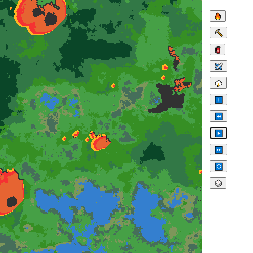
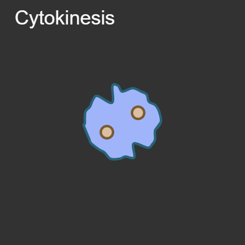

sketchbook
==========

Collection of personal coding projects. They may or may not grow into individual projects.

## Latest

A p5.js sketch that demonstrates computing the closest point on a line, from a given point.

[][link-p5js-shapes-tangents-between-circles]

## LÖVE
Collection of sketches using the [LÖVE][love2d] environment.

[][link-love2d-game-of-life]

## paper.js
Collection of sketches using the [paper.js][paperjs] Javascript library.

[][link-paperjs-10-print]
[][link-paperjs-drawing-app]
[][link-paperjs-interaction-of-color]
[][link-paperjs-race-track]

## p5.js
Collection of sketches using the [p5.js][p5js] Javascript library.

[][link-p5js-bezier]
[][link-p5js-draggable]
[][link-p5js-geometry-circle-line]
[][link-p5js-geometry-point-to-line]
[][link-p5js-paisley]
[][link-p5js-quadtree]
[][link-p5js-quadtree-2]
[][link-p5js-shapes-tangents-between-circles]
[][link-p5js-teardrops]
[][link-p5js-voronoi]
[][link-p5js-voronoi-2]
[][link-p5js-ecosystem]
[][link-p5js-forest-01]
[][link-p5js-forest-fires-02]
[][link-p5js-forest-fires]
[][link-p5js-friezes]
[][link-p5js-hello_world]
[][link-p5js-josef-albers-homage-to-a-square]
[][link-p5js-keyviz]
[][link-p5js-logic-gates]
[][link-p5js-meandering-river]
[][link-p5js-nautical-flags-02]
[][link-p5js-nautical-flags]
[][link-p5js-paisley-01]
[][link-p5js-slippy-map]
[][link-p5js-snowflake-pen]
[][link-p5js-thermal-cells]
[][link-p5js-random-1]
[][link-p5js-random-2]
[][link-p5js-random-3]
[][link-p5js-tree-rings]
[][link-p5js-voronoi-herd]

## p5.js - Coding Challenges
Collection of sketches using the [p5.js][p5js] Javascript library inspired by the [Coding Train's][coding-train] [Coding Challenges][coding-train-cc].

[][link-p5js-cc-fractal-trees-01]
[][link-p5js-cc-fractal-trees-02]
[][link-p5js-cc-fractal-trees-03]
[][link-p5js-cc-fractal-trees-04]
[][link-p5js-cc-fractal-trees-05]
[][link-p5js-cc-maze-generator]
[][link-p5js-cc-mitosis]
[][link-p5js-cc-seven-segment-display]
[][link-p5js-cc-snake]
[][link-p5js-cc-solar-system-3d-texturized]
[][link-p5js-cc-solar-system-3d]
[][link-p5js-cc-solar-system]
[][link-p5js-cc-space-invaders]

## Processing
Collection of sketches using the [Processing (P3)][processing] environment.

[][link-attractors]
[][link-dodgeball]
[][link-event_sequencer]
[][link-fieldeq]
[][link-game_of_life]
[][link-hexagonal]
[][link-hockey]
[][link-hockey_01]
[][link-interaction_of_color]
[][link-keyviz]
[][link-network]
[][link-number_visualizer]
[][link-random_001]
[][link-series_plots]
[][link-smart_traffic]
[][link-spirals]
[][link-thermal_cells]
[][link-three_d_blocks]

[love2d]: https://love2d.org/
[p5js]: https://p5js.org/
[paperjs]: http://paperjs.org/
[processing]: https://processing.org/
[coding-train]: https://www.youtube.com/channel/UCvjgXvBlbQiydffZU7m1_aw
[coding-train-cc]: https://www.youtube.com/watch?v=17WoOqgXsRM&list=PLRqwX-V7Uu6ZiZxtDDRCi6uhfTH4FilpH&index=1

[link-love2d-game-of-life]: https://github.com/brianhonohan/sketchbook/tree/master/love2d/game-of-life

[link-paperjs-interaction-of-color]: https://github.com/brianhonohan/sketchbook/tree/master/paperjs/interaction-of-color
[link-paperjs-race-track]: https://github.com/brianhonohan/sketchbook/tree/master/paperjs/race-track
[link-paperjs-10-print]: https://github.com/brianhonohan/sketchbook/tree/master/paperjs/10-print
[link-paperjs-drawing-app]: https://github.com/brianhonohan/sketchbook/tree/master/paperjs/drawing-app

[link-p5js-bezier]: https://github.com/brianhonohan/sketchbook/tree/master/p5js/common/examples/bezier/
[link-p5js-draggable]: https://github.com/brianhonohan/sketchbook/tree/master/p5js/common/examples/draggable/
[link-p5js-geometry-circle-line]: https://github.com/brianhonohan/sketchbook/tree/master/p5js/common/examples/geometry-circle-line/
[link-p5js-geometry-point-to-line]: https://github.com/brianhonohan/sketchbook/tree/master/p5js/common/examples/geometry-point-to-line/
[link-p5js-ecosystem]: https://github.com/brianhonohan/sketchbook/tree/master/p5js/ecosystem/
[link-p5js-forest-01]: https://github.com/brianhonohan/sketchbook/tree/master/p5js/forest-01/
[link-p5js-forest-fires-02]: https://github.com/brianhonohan/sketchbook/tree/master/p5js/forest-fires-02/
[link-p5js-forest-fires]: https://github.com/brianhonohan/sketchbook/tree/master/p5js/forest-fires/
[link-p5js-friezes]: https://github.com/brianhonohan/sketchbook/tree/master/p5js/friezes/
[link-p5js-hello_world]: https://github.com/brianhonohan/sketchbook/tree/master/p5js/hello_world/
[link-p5js-josef-albers-homage-to-a-square]: https://github.com/brianhonohan/sketchbook/tree/master/p5js/josef-albers-homage-to-a-square/
[link-p5js-keyviz]: https://github.com/brianhonohan/sketchbook/tree/master/p5js/keyviz/
[link-p5js-logic-gates]: https://github.com/brianhonohan/sketchbook/tree/master/p5js/logic-gates/
[link-p5js-meandering-river]: https://github.com/brianhonohan/sketchbook/tree/master/p5js/meandering-river/
[link-p5js-nautical-flags-02]: https://github.com/brianhonohan/sketchbook/tree/master/p5js/nautical-flags-02/
[link-p5js-nautical-flags]: https://github.com/brianhonohan/sketchbook/tree/master/p5js/nautical-flags/
[link-p5js-paisley]: https://github.com/brianhonohan/sketchbook/tree/master/p5js/common/examples/paisley/
[link-p5js-paisley-01]: https://github.com/brianhonohan/sketchbook/tree/master/p5js/paisley-01/
[link-p5js-quadtree]: https://github.com/brianhonohan/sketchbook/tree/master/p5js/common/examples/quadtree/
[link-p5js-quadtree-2]: https://github.com/brianhonohan/sketchbook/tree/master/p5js/common/examples/quadtree-2/
[link-p5js-shapes-tangents-between-circles]: https://github.com/brianhonohan/sketchbook/tree/master/p5js/common/examples/shapes-tangents-between-circles/
[link-p5js-voronoi]: https://github.com/brianhonohan/sketchbook/tree/master/p5js/common/examples/voronoi/
[link-p5js-voronoi-2]: https://github.com/brianhonohan/sketchbook/tree/master/p5js/common/examples/voronoi-2/
[link-p5js-random-1]: https://github.com/brianhonohan/sketchbook/tree/master/p5js/random/1/
[link-p5js-random-2]: https://github.com/brianhonohan/sketchbook/tree/master/p5js/random/2/
[link-p5js-random-3]: https://github.com/brianhonohan/sketchbook/tree/master/p5js/random/3/
[link-p5js-slippy-map]: https://github.com/brianhonohan/sketchbook/tree/master/p5js/slippy-map/
[link-p5js-snowflake-pen]: https://github.com/brianhonohan/sketchbook/tree/master/p5js/snowflake-pen/
[link-p5js-teardrops]: https://github.com/brianhonohan/sketchbook/tree/master/p5js/common/examples/teardrops/
[link-p5js-thermal-cells]: https://github.com/brianhonohan/sketchbook/tree/master/p5js/thermal-cells/
[link-p5js-tree-rings]: https://github.com/brianhonohan/sketchbook/tree/master/p5js/tree-rings/
[link-p5js-voronoi-herd]: https://github.com/brianhonohan/sketchbook/tree/master/p5js/voronoi-herd/

[link-p5js-cc-fractal-trees-01]: https://github.com/brianhonohan/sketchbook/tree/master/p5js/coding-challenges/fractal-trees-01/
[link-p5js-cc-fractal-trees-02]: https://github.com/brianhonohan/sketchbook/tree/master/p5js/coding-challenges/fractal-trees-02/
[link-p5js-cc-fractal-trees-03]: https://github.com/brianhonohan/sketchbook/tree/master/p5js/coding-challenges/fractal-trees-03/
[link-p5js-cc-fractal-trees-04]: https://github.com/brianhonohan/sketchbook/tree/master/p5js/coding-challenges/fractal-trees-04/
[link-p5js-cc-fractal-trees-05]: https://github.com/brianhonohan/sketchbook/tree/master/p5js/coding-challenges/fractal-trees-05/
[link-p5js-cc-maze-generator]: https://github.com/brianhonohan/sketchbook/tree/master/p5js/coding-challenges/maze-generator/
[link-p5js-cc-mitosis]: https://github.com/brianhonohan/sketchbook/tree/master/p5js/coding-challenges/mitosis/
[link-p5js-cc-seven-segment-display]: https://github.com/brianhonohan/sketchbook/tree/master/p5js/coding-challenges/seven-segment-display/
[link-p5js-cc-snake]: https://github.com/brianhonohan/sketchbook/tree/master/p5js/coding-challenges/snake/
[link-p5js-cc-solar-system-3d-texturized]: https://github.com/brianhonohan/sketchbook/tree/master/p5js/coding-challenges/solar-system-3d-texturized/
[link-p5js-cc-solar-system-3d]: https://github.com/brianhonohan/sketchbook/tree/master/p5js/coding-challenges/solar-system-3d/
[link-p5js-cc-solar-system]: https://github.com/brianhonohan/sketchbook/tree/master/p5js/coding-challenges/solar-system/
[link-p5js-cc-space-invaders]: https://github.com/brianhonohan/sketchbook/tree/master/p5js/coding-challenges/space-invaders/

[link-attractors]: https://github.com/brianhonohan/sketchbook/tree/master/processing/attractors
[link-dodgeball]: https://github.com/brianhonohan/sketchbook/tree/master/processing/dodgeball
[link-event_sequencer]: https://github.com/brianhonohan/sketchbook/tree/master/processing/event_sequencer
[link-fieldeq]: https://github.com/brianhonohan/sketchbook/tree/master/processing/fieldeq
[link-game_of_life]: https://github.com/brianhonohan/sketchbook/tree/master/processing/game_of_life
[link-hexagonal]: https://github.com/brianhonohan/sketchbook/tree/master/processing/hexagonal
[link-hockey]: https://github.com/brianhonohan/sketchbook/tree/master/processing/hockey
[link-hockey_01]: https://github.com/brianhonohan/sketchbook/tree/master/processing/hockey_01
[link-interaction_of_color]: https://github.com/brianhonohan/sketchbook/tree/master/processing/interaction_of_color
[link-keyviz]: https://github.com/brianhonohan/sketchbook/tree/master/processing/keyviz
[link-network]: https://github.com/brianhonohan/sketchbook/tree/master/processing/network
[link-number_visualizer]: https://github.com/brianhonohan/sketchbook/tree/master/processing/number_visualizer
[link-random_001]: https://github.com/brianhonohan/sketchbook/tree/master/processing/random_001
[link-series_plots]: https://github.com/brianhonohan/sketchbook/tree/master/processing/series_plots
[link-smart_traffic]: https://github.com/brianhonohan/sketchbook/tree/master/processing/smart_traffic
[link-spirals]: https://github.com/brianhonohan/sketchbook/tree/master/processing/spirals
[link-thermal_cells]: https://github.com/brianhonohan/sketchbook/tree/master/processing/thermal_cells
[link-three_d_blocks]: https://github.com/brianhonohan/sketchbook/tree/master/processing/three_d_blocks

[link-ruby-console-art]: https://github.com/brianhonohan/sketchbook/tree/master/ruby/console-art
