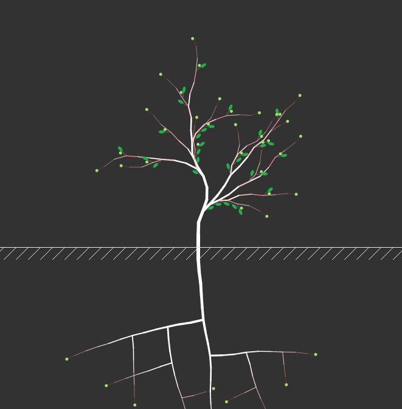

## Overview

This is a [p5.js][p5js-home] sketch inspired by the [Coding Train's][coding-train] [Coding Challenge #15][ct-challenge-15] on creating a simulation of Fractal Trees with Objects.

This served to explore some of the internal physiology of tree growth.

#### Plant Physiology Modeled: (all links out to Wikipedia pages)
* How [Meristems][wikipedia-meristem] are stem cells within plants that are responsible for the creation of different plant organs and regulate growth.
    - In this this sketch, the small elliptical leaves are produced by the meristems.
* That [Apical Meristems][wikipedia-apical-meristem] are at the ends (tips / apex) of the stems and regulate growth by production of [Auxins][wikipedia-auxin].
    - These are visualized as green-circles at the end of segments.
* [Auxin][wikipedia-auxin] is a plant hormone that at high levels leads to elongation of shoots, and supresses lateral growth (both in terms of widenning of branches and opening of lateral buds).
    - The Auxin concentration is visualized by a reddening of the otherwise white tree segments.
* [Axillary-buds][wikipedia-axillary-bud] are created by Apical Meristems at the attachment point of leaves, but their growth is dormant until the Apical Meristem has grown sufficiently far a way. This is a form of [Apical Dominance][wikipedia-apical-dominance].
    - The buds are yellow circles, seen at the attach point of leaves.
* [Gravitropism][wikipedia-gravitropism] is a natural behavior of plants to grow relative to the gravity they are experiencing. 
    - In this sketch, this is demonstrated within the roots, where the root segments have a a sense of which direction they are growing in, which drives their branching behavior. (Only segments growing downard oscillate between branches on each side; left and right segments only branch downward).

## Controls

Keys:

-  `=` / `-` /  (+/-, without the SHIFT key) To zoom in and out

Mouse:

- Mouse Wheel to zoom in / out

# Links: 

* [Live View][live-view]
* [Source on Github][source-code]

## Screenshot:

[p5js-home]: http://p5js.org/
[coding-train]: https://thecodingtrain.com/
[ct-challenge-15]: https://www.youtube.com/watch?v=fcdNSZ9IzJM&index=18&list=PLRqwX-V7Uu6ZiZxtDDRCi6uhfTH4FilpH
[source-code]: https://github.com/brianhonohan/sketchbook/tree/master/p5js/coding-challenges/fractal-trees-03/
[live-view]: https://brianhonohan.com/sketchbook/p5js/coding-challenges/fractal-trees-03/
[wikipedia-meristem]: https://en.wikipedia.org/wiki/Meristem
[wikipedia-apical-meristem]: https://en.wikipedia.org/wiki/Meristem#Apical_meristems
[wikipedia-apical-dominance]: https://en.wikipedia.org/wiki/Meristem#Apical_dominance
[wikipedia-auxin]: https://en.wikipedia.org/wiki/Auxin
[wikipedia-axillary-bud]: https://en.wikipedia.org/wiki/Axillary_bud
[wikipedia-gravitropism]: https://en.wikipedia.org/wiki/Gravitropism
[wikipedia-gravitropism-inroots]: https://en.wikipedia.org/wiki/Gravitropism#In_the_root
[screenshot]: ./screenshot.png