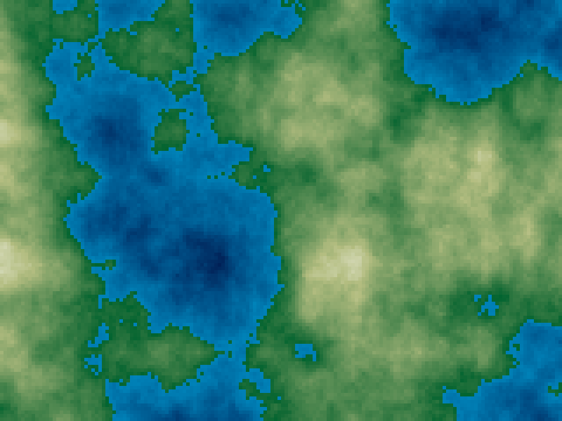

# Ecosystem

## Idea:
Randomly generate a terrain with a set of resources that organisms will compete over.

## Config Options
The Javascript parses the following URL parameters:

| Param         | Description                                          | Data type | Approx Range | Default |
|---------------|------------------------------------------------------|-----------|--------------|---------|
| cellWidth     | Controls the resolution of the terrain.              | Integer   | 1-100        | 5       |
| scale         | Controls the approximate zoom-scale of the terrain.  | Float     |              | 0.02    |
| noise.octaves | The `lod` parameter into P5JS's `noiseDetail`        | Integer   | 1-10         | 10      |
| noise.falloff | The `falloff` parameter into P5JS's `noiseDetail`    | Float   | 0 - 1         | 0.6     |
| percentWater | The approximate percent of area to cover with water.  | Float   | 0 - 1         | 0.5     |
| erosionRate | The rate of erosion per cycle                        | Float   | 0 - 0.5         | 0     |

# Links: 

* [Live View][live-view]
* [Source on Github][source-code]

## Snapshot:

v2 with Resources - ultimately, disabled this code

[p5js-home]: https://p5js.org/
[source-code]: https://github.com/brianhonohan/sketchbook/tree/master/p5js/ecosystem/
[live-view]: https://brianhonohan.com/sketchbook/p5js/ecosystem/
[screenshot-01]: ./screenshot-01.png
