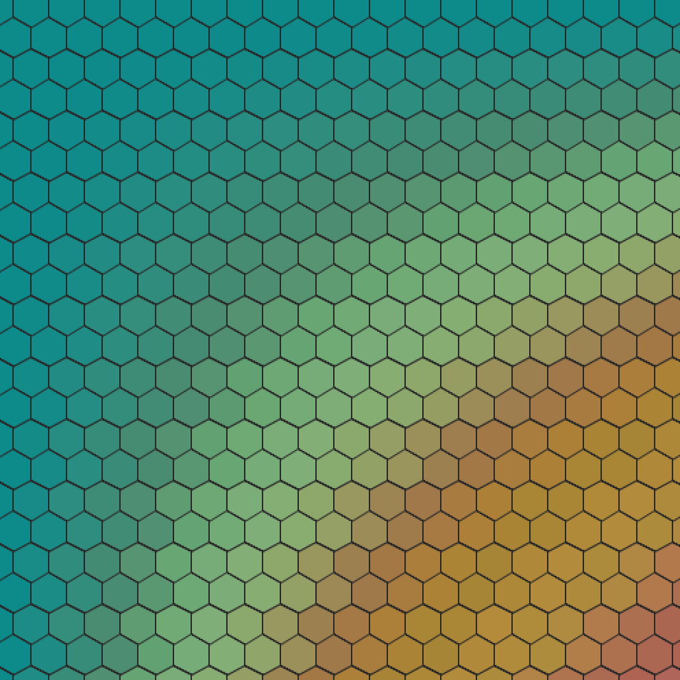

## Overview

The intent of this sketch was to:

- Explore what it would take to render a layout of hexagons and detect mouse clicks
- It is built with [Processing][processing-home].

After developing this, I came across this post [Hexagonal Grid Reference][redblobgames-hexagons] from Amit Patel, which has a wonderful collection of resources for working with hexagons.

I would like to explore that list (and other resources) and revisit my approach here.

Keys:

- `f` Toggles the setting of overflowing the hexagons to the viewable area.
- `C` (capital C) fills the area with a grey.
- `r` Changes the random seed (only used for color palette).
- `s` Sets the 'radius' of the hexagon to a value based on the mouse's X position (left most edge maps to `20px` and right edge maps to `200px`)
- `c` Redraws the hexagon grid with the current settings and same random seed (useful to clear out hexagons highlighted while mousing over areas).

Mouse:

- `HOVER` / `CLICK` Highlight the hexagon below the mouse's current position.

## Links: 

* [Live View](https://brianhonohan.com/sketchbook/processing/2016/03/15/processing-hexagonal-layout.html)
* [Source on Github](https://github.com/brianhonohan/sketchbook/tree/master/processing/hexagonal)

[source-code]: https://github.com/brianhonohan/sketchbook/tree/master/processing/hexagonal
[processing-home]: https://processing.org
[redblobgames-hexagons]: https://www.redblobgames.com/grids/hexagons/
