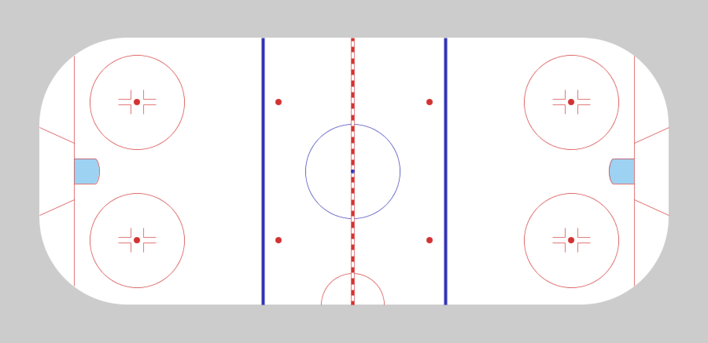

## Overview

The intent of this sketch was to:

- Gain a comfort level in [Processing][processing-home]'s drawing functions.
- Learn a bit more about the nuance of the geometry of Hockey rinks.
- Perhaps be a foundation to a parameterized rendering of a Hockey rink for a future sketch where the dimensions of rink can be altered. (e.g. illustrating how the geometry of the rink has changed overtime.)

## Interaction

This is a static sketch, which doesn't offer any interaction.

But, in the subsequent [sketch with puck trajctory calculations][sketch-hockey-01], which computes the direction the puck will bounce off of the wall, you can move the puck around and see where it would go.

Dimensions were obtained from:

- [sportsknowhow.com][sportsknowhow-hockey]
- [nhl.com][nhl-ice]

## Links: 

* [Live View](https://brianhonohan.com/sketchbook/processing/2016/03/25/processing-hockey-rink.html)
* [Source on Github](https://github.com/brianhonohan/sketchbook/tree/master/processing/hockey)

## Snapshot:

[processing-home]: https://processing.org
[sportsknowhow-hockey]: http://www.sportsknowhow.com/hockey/dimensions/hockey-rink-dimensions.html
[nhl-ice]: http://www.nhl.com/ice/page.htm?id=26394
[sketch-hockey-01]: https://brianhonohan.com/sketchbook/processing/hockey_01/