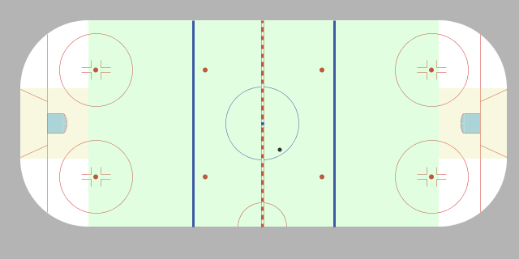
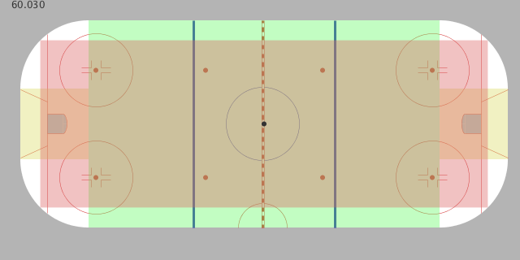
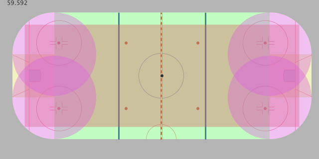
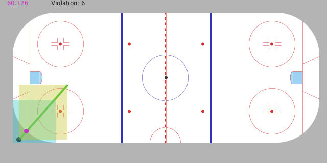

The goal of this sketch was to establish the x-y constraints for the puck (and later Players) moving around a Hockey rink.

This ended up being a fairly involved process, including one off-shoot exploration of geometry in: [https://github.com/brianhonohan/sketchbook/pull/91](https://github.com/brianhonohan/sketchbook/pull/91)

Some notes about my approach:

* [`4c997515`](https://github.com/brianhonohan/sketchbook/pull/92/commits/4c997515a68b584480d37724a2d2eb00cf0b5784) - Creating a "mock" puck with a draggable trajectory vastly accelerated my development
    - This was inspired by that PR above.
* I used "Viewer" classes to translated the pure data models to the screen
    - This was an approach I established in the base sketch and continued here. I've done a fair bit of other sketches in the mean time without this dual mode of translating screen coordinates down to model coords, and back ... but once I re-bought into it (and had simple utility functions: like `transformXToRinkX(...)` and `transformRinkXToX(...)`) it wasn't too bad.

I'll try to do a more in depth write but, here is the gist of the collision detection added in this PR:

## Step 1 - Establish (simple) Open Areas of the ice

If the Puck is in this areas, don't need to perform any further checks or alter position or velocity.

But if the Puck is beyond the min X or Y, or max X or Y, then try to determine the board it hit.

* [`b5405807`](https://github.com/brianhonohan/sketchbook/pull/92/commits/b5405807def6081abb4393caecb6b851b95e9f4a) - Initial (albeit flawed) approach to determine the end or side boards (straight line boundaries)
* Fixed / improved in these two commits to factor in the starting position of the puck, because it may have cross through a corner to get to the zone that would previously been interpreted as having hit a straight end or side board.
    - [`1f625dbe`](https://github.com/brianhonohan/sketchbook/pull/92/commits/1f625dbef557ed2c46854085a7aca7f9db84046f)
    - [`95855886`](https://github.com/brianhonohan/sketchbook/pull/92/commits/95855886eecd81b835389bfdc339d90aa9fac542)

## Step 2 - Add another (overlapping) open area for simple checks

This has two benefits:

- Adds to the area that a quick check (without performing distance checks with square roots) will suffice when the Puck is in an open area.
- Handles the case I was seeing where the Puck would be straddling two of the open areas but not fully in either one; thus wrongly interpreted as violating a constraint.

## Step 3 - Consider the corners to be open areas

This came through in two commits:

- [`9e9596cd`](https://github.com/brianhonohan/sketchbook/pull/92/commits/9e9596cd92d219ed5cfde2cd7e1794423b665025) - Simply defines the corners as `Circle` objects and renders them.
- [`80849d95`](https://github.com/brianhonohan/sketchbook/pull/92/commits/80849d9577c0029f47bf7b783f1d7c8330c80c6d) - Determines if the Puck is within the corner `Circle`, factoring in the Puck's radius.

## Step 4 - Determine the point on the corner that the Puck has hit

This was added through:

- [`ae9ef41b1`](https://github.com/brianhonohan/sketchbook/pull/92/commits/ae9ef41b151c0ad542de78986ccdceed3ac01793) - Initial commit, which included visual debugging areas; 
  - My underlying algorithm would return two points that the `LineSegment` of the Puck's trajectory will hit on the `Circle`; it needs to be in both of the rectangles to be the desired point.
- [`126c4ccac`](https://github.com/brianhonohan/sketchbook/pull/92/commits/126c4ccacb4de23a2734ff1ca1e1c5bc3068b9a1) - A fix in creating what is shown as the yellowish rectangle. (Needed to factor in the Puck's maximum extents, and thus used the `Rect.expandToInclude(...)` to increase the Yellow rectangle to include the full Puck).

## Step 5 - (Try to) Bounce the Puck off the corners

* [`1b735880`](https://github.com/brianhonohan/sketchbook/pull/92/commits/1b73588047788f635da6dd4d2e726f7e9db4951c) - Visual debugging of the Puck's new location and velocity
* [`b47c8912`](https://github.com/brianhonohan/sketchbook/pull/92/commits/b47c8912ad7ff099470fe0e516f634cc38dc0b77) - Preliminary (but unfortunately bug-ridden) approach to bouncing a puck off of a curved surface

(Screenshot shows the incorrect calculation of the new Puck location ... but the errors were different for each corner, with the bottom left corner being nearly perfect, so I new I was on the right path).

## Step 6 - Debugging / tweaking

Eventually ironed out most of the bugs. 

(I think there are other improvements to be made regarding collision points of end and side boards, but this is satisfactory for now).

## Next:

* Consider recursively apply the constraints in a single frame, sometimes it bounces off of two walls (or same wall twice or more) in the same iteration; currently that is not handled and the puck is allowed to disappear.
* But I think I might jump to some goal line detection (and maybe basic icing) and hopefully move onto autonomous agents that can learn to play Hockey.

