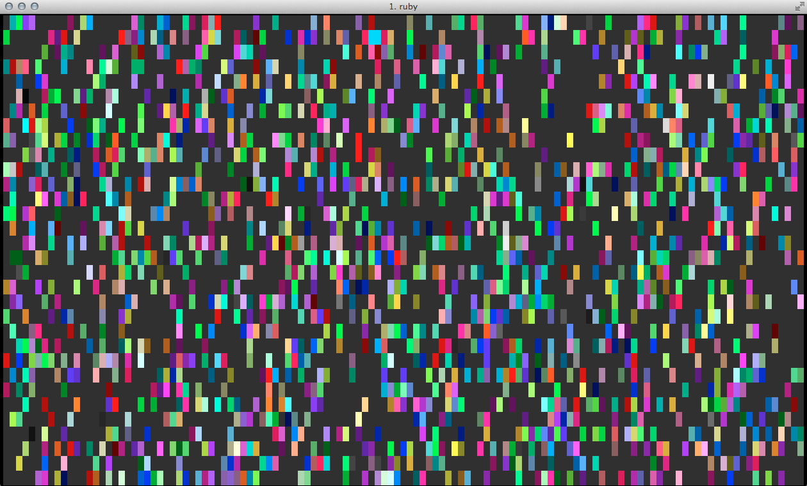
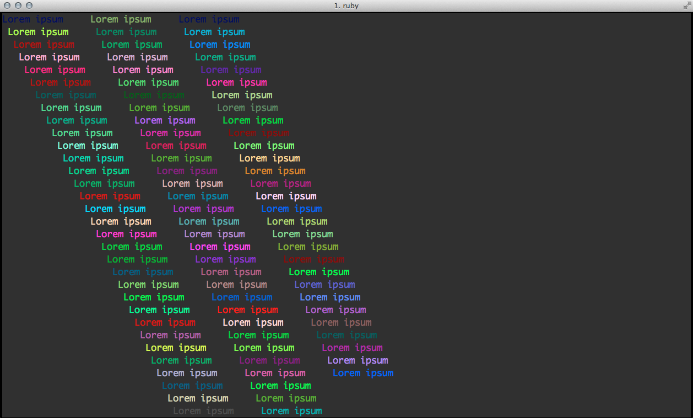
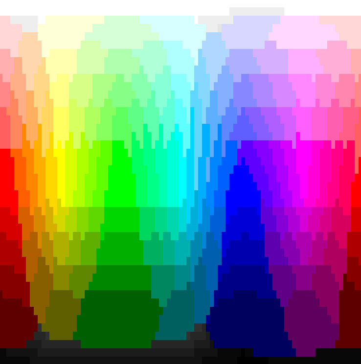
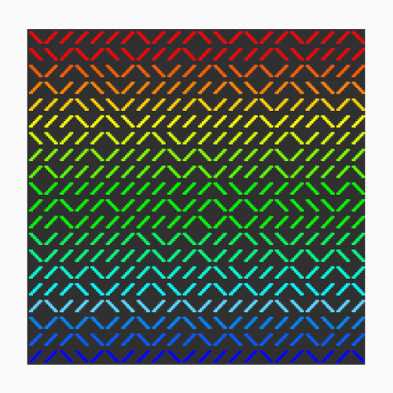

# Ruby - console sketches

## Overview:
This is inspired by [processing.org](https://processing.org), and is a basic attempt to faciliate drawing to a terminal console within a Ruby Script.

The primary concepts reside in the [lib/sketch.rb](lib/sketch.rb)

Subclasses of that Ruby class get two methods, and the overall template of a sketch looks like:

```ruby
require_relative '../lib/sketch.rb'

class ConsoleSketch < Sketch
  def setup
    # called once at startup
  end

  def draw
  	# called once per frame  
  end
end
```

And there are some basic methods provided to subclasses:


| Method | Description |
|--------|-------------|
| `width`  | Returns the width of the console window in terms of number of characters.           |
| `height` | Returns the height of the console window in terms of number of characters           |
| `color(r, g, b)` | Returns a representation of the RGB color (0-255) based, that can be passed into color setting functions |
| `color_hsl(h, s, l)` | Returns a representation of the HSL color (0-1) based, that can be passed into color setting functions |
| `stroke( color )` | Sets the stroke color of text display) |
| `fill( color )` | Sets the background color of text output. |
| `print_at(text, x, y)` | Displays the `text` string at the specified coordinates. |
| `fill_background` | Fills the screen with the current `fill()` color. |


## Requires:

* Ruby 2.7.5 
* Bundler


## Setup:

```
bundle install
```

## Running:

```
bundle exec ruby ./sketches/random_color.rb
```

## Example Output:

[sketches/random_color.rb](sketches/random_color.rb)


[sketches/striped_string.rb](sketches/striped_string.rb)


[sketches/color_chart.rb](sketches/color_chart.rb)


[sketches/10_print.rb](sketches/color_chart.rb)

